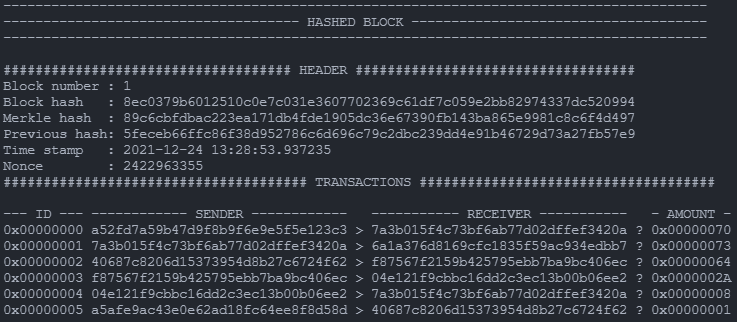
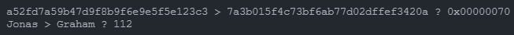

# BLOCKCHAIN DATA STRUCTURE
This a basic implementation of the blockchain data structure without a merkle tree nor any proof of work. Only blocks referecing previous blocks. Only coding it for learning purposes.

---

## Block
A block is usually composed of:
- The **previous** block's **HASH**
- A list of **transactions** (or any data i guess)
- A **time stamp** with the time at which the block was created
- A **merkle** : the resultant hash of a [merkle tree](https://en.wikipedia.org/wiki/Merkle_tree) made from transactions
- A none : Number Only Used Once - Usually used for the [Proof Of Work](https://en.wikipedia.org/wiki/Proof_of_work)
- And obviously the block's **HASH**

Example :

```python
	# Create some transactions
	t = []
	t.append(transaction("Jonas" , "Graham"  , 112))
	t.append(transaction("Graham" , "Joseph" , 115))
	t.append(transaction("Jack"   , "Patrick", 100))
	t.append(transaction("Patrick", "Steph"  , 42))
	t.append(transaction("Steph"  , "Graham" , 8))
	t.append(transaction("Marlene", "Jack"   , 1))

	# Create a new block
	block_1 = block.block(1, t, hashlib.sha256("0".encode('ASCII')).hexdigest())
	block_1.show_hashed()
```



---

## Transaction
A transaction usually contains some relatively complicated things i did not look into and that i did not implement yet, mine only contains:
- A **sender**
- A **receiver**
- An **amount**

Example :
```python
transaction_1 = transaction("Jonas" , "Graham"  , 112)
print(transaction_1.get_hashed_transaction_string())
print(transaction_1.get_transaction_string())
```



---

## Blockchain
It's the actual data structure, it contains blocks each referencing to the previous one, allowing only one valid chain.
Some things need to be set by hand at the beginning, like the **genesis block** that should be hard coded afaik. Then you could add blocks to your chain pretty easily. Though without any **Proof Of Work**, anyone could change a transaction in a block and easily compute the hash of the next blocks... So i'll need to implement it one day.